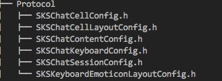
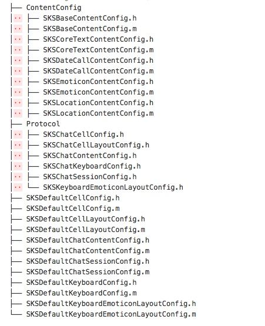
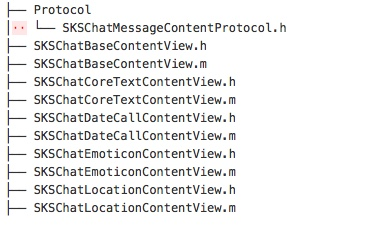

# `ChatKit` 教程

### `ChatKit` 视图中的结构划分:
1. 头像视图
1. 时间标签视图
1. 已读未读视图
1. 发送失败/发送中视图
1. 该类型具体的内容视图（以下也是详细解释这一部分的具体步骤）

---
### 比较重要的几个协议
，大部分的内容都是围绕这个几个协议来展开的。

---
### `SKSChatCellConfig` 协议详解

#### 1. `SKSChatCellConfig` 功能：
该协议定义了 `Cell` 中的样式
1. 定义了接口获取文字视图中的最小大小
2. 定义了接口获取气泡的尖角宽度
3. 定义了接口获取已读/未读视图的字体大小，颜色，`Image`, 是使用图片还是纯文字形式
4. 定义了接口获取 `Cell` 中的背景色
5. 定义了接口获取时间标签视图的字体大小，颜色，背景色
6. 定义了接口获取发送失败视图的 `Image`

---
### `SKSChatContentConfig` 协议详解

#### 1. `SKSChatContentConfig` 目录结构：

如下图所示是部分 `ChatKit` 已经实现好的 `ContentConfig` 实例，都是需要实现 `SKSChatContentConfig` 协议
  
  
#### 2. `SKSChatContentConfig` 功能：
该协议定义了聊天 `Cell` 中的 `ContentView` （`ContentView`: 拿文字视图来说，具体指聊天界面中气泡视图上面的那个存放文字的控件 UILabel/UITextView 视图），以及支持添加 `ContentView` 中子 View 中字体大小颜色，控件边距等自定义参数。

具体的功能总结为如下
1. 定义了接口获取 `ContentView` 的 Size 属性, 使用者需要实现该方法，并且返回正确的 Size
2. 定义了接口获取 `ContentView` 的 Class 名称，使用者需要实现该方法，并且返回正确的 `ContentView` 类名称
3. 定了了接口获取 `ContentView` 所在 Cell 的重用 identifier, 使用者需要实现该方法，并且放回正确的 Cell 的 identifier。
4. 定义了接口获取 `ContentView` 与气泡视图的边距(`BubbleView`: 代表气泡视图，聊天中的Cell大部分类型都会有气泡视图)
5. 定义了接口获取 `BubbleView` 与 `Cell` 之间的边距，因为时间标签视图也处于 Cell 之中，所以需要区分该 Cell 中视图存在时间标签视图
6. `ChatKit` 会根据 `ContentView` 的大小以及 `ContentView` 与 `BubbleView` 之间的边距来确定 `BubbleView` 视图的大小，然后根据规则5就确定好 `BubbleView` 的位置
7. 定义了接口更新 `ContentView` 内容，因为考虑到有重用特性，所以提供该接口
8. 定义了接口获取时间标签视图的大小，以及时间标签视图与 `Cell` 之间的边距

#### 3. `SKSChatContentConfig` Example
具体的例子可以参考 `ContentConfig` 目录下已经实现了的实例，或者`ChatKit` 项目中的 Example 项目

---
### `SKSChatMessageContentProtocol` 协议详解

#### 1. `SKSChatMessageContentProtocol` 目录结构
如下图所示就是 `ChatKit` 已经实现好了的一些 `ContentView`, 需要遵循的规则就是要实现 `SKSChatMessageContentProtocol` 协议

---
### `SKSChatCellLayoutConfig` 协议详解

#### 1. `SKSChatCellLayoutConfig` 功能
`SKSChatCellLayoutConfig` 布局配置协议, 跟 `ContentView`, `BubbleView`, `TimeLabelView` 相关的的配置都是从 `SKSChatContentConfig` 实例中获取，因为存在不同类型的 `ContentView` 类型，所以存在不同的实现了 `SKSChatCellLayourConfig` 协议的实例，而 `SKSChatCellLayoutConfig` 只是负责隐藏细节而已。
1. 定义接口获取 `Cell` 类名， `Cell Identifier`, `ContentView Size`
2. 定义接口获取 `BubbleView`(气泡视图) 与 `Cell` 之间的间距
3. 定义接口获取 `ContentView` 与 `BubbleView` 之间的间距
4. 定义接口获取 `AvatarView`(头像视图) 与 `Cell` 之间的间距， `AvatarView Size`
5. 定义接口获取 时间标签视图大小，时间标签视图与 `Cell` 之间的边距
6. 定义接口获取 已读/未读视图与 `Cell` 之间的边距

#### 2. `SKSChatCellLayourConfig` Example
具体的例子可以参考 `SKSDefaultCellLayoutConfig` 类

---
### `SKSChatSessionConfig` 协议详解

#### 1. `SKSChatSessionConfig` 功能
该协议主要定义了一个聊天窗口中的总配置，因为有可能有管理员窗口，陌生人关系窗口，好友关系窗口或者以后的消息通知窗口等，这些窗口都有可能存在不同的配置选项。

1. 定义接口获取默认头像
2. 定义接口获取时间标签的显示间隔
3. 定义接口获取录音时间的最长时间
4. 定义接口获取气泡视图的尖角偏移量
5. 定义接口获取实现了 `SKSChatCellLayoutConfig` 协议的实例
6. 定义接口获取实现了 `SKSChatCellConfig` 协议的实例
7. 定义接口获取实现了 `SKSChatContentConfig` 协议的实例
8. 定义接口获取实现了 `SKSChatKeyboardConfig` 协议的实例
9. 定义接口获取头像视图的类名称, 该类必须实现了 `SKSMessageAvatarProtocol` 协议，否则会默认使用 `SKSMessageAvatarButton` 类
10. 定义接口获取气泡视图图像名称

---
### `SKSChatKeyboardConfig` 协议详解

#### 1. `SKSChatKeyboardConfig` 功能
`SKSChatKeyboardConfig` 配置协议，定义了获取键盘中的布局，样式, 文案，以及表情数据源等接口
